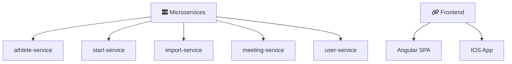

# SwimResults

```mermaid
flowchart TD
    A[fa:fa-server Microservices]
    A --> O[athlete-service]
    A --> P[start-service]
    A --> Q[import-service]
    A --> R[meeting-service]
    A --> S[user-service]
    B[fa:fa-link Frontend]
    B --> H[Angular SPA]
    B --> I[IOS App]
```
