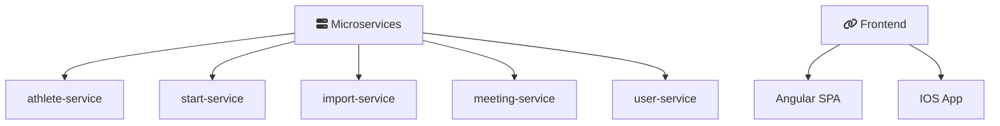

# SwimResults

## Project Structure

### Frontend and Webpages

[WebApplication](https://github.com/SwimResults/WebApplication) 

[StatusPage](https://github.com/SwimResults/StatusPage) 

### Backend (Microservices)

[athlete-service](https://github.com/SwimResults/athlete-service) 

[start-service](https://github.com/SwimResults/start-service) 

### Diagram

