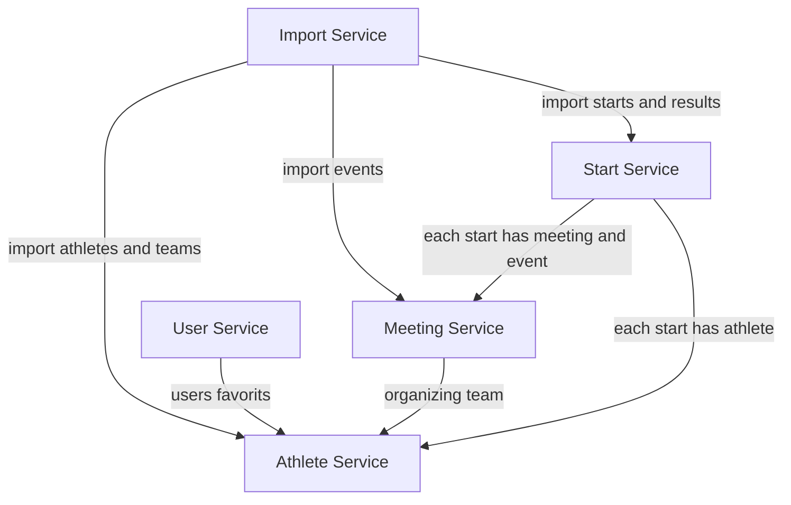

# SwimResults

## Project Structure

<table>
    <thead>
        <tr>
            <th>System</th>
            <th>Description</th>
            <th>Progress</th>
            <th>Status</th>
        </tr>
    </thead>
    <tbody>
        <tr>
            <td colspan=4><b>Frontend and Webpages</b></td>
        </tr>
        <tr>
            <td>WebApplication</td>
            <td>🔗 <a href="https://github.com/SwimResults/WebApplication">Link</a></td>
            <td>🟡</td>
            <td>
                
                 
                
                 
                
                <!--img alt="Weblate project translated" src="https://img.shields.io/weblate/progress/swimresults?server=https%3A%2F%2Fweblate.swimresults.de&style=flat-square"-->
            </td>
        </tr>
        <tr>
            <td>Homepage</td>
            <td>🔗 <a href="https://github.com/SwimResults/Homepage">Link</a></td>
            <td>🟡</td>
            <td>
                
                 
                
                 
                
                <!--img alt="Weblate project translated" src="https://img.shields.io/weblate/progress/swimresults?server=https%3A%2F%2Fweblate.swimresults.de&style=flat-square"-->
            </td>
        </tr>
        <tr>
            <td>StatusPage</td>
            <td>🔗 <a href="https://github.com/SwimResults/StatusPage">Link</a></td>
            <td>🟡</td>
            <td>
                
                 
                
            </td>
        </tr>
        <tr>
            <td colspan=4><b>Backend (Microservices)</b></td>
        </tr>
        <tr>
            <td>athlete-service</td>
            <td>🔗 <a href="https://github.com/SwimResults/athlete-service">Link</a></td>
            <td>🟡</td>
            <td>
                
            </td>
        </tr>
        <tr>
            <td>start-service</td>
            <td>🔗 <a href="https://github.com/SwimResults/start-service">Link</a></td>
            <td>🟡</td>
            <td></td>
        </tr>
        <tr>
            <td>user-service</td>
            <td>🔗 <a href="https://github.com/SwimResults/user-service">Link</a></td>
            <td>🔴</td>
            <td></td>
        </tr>
        <tr>
            <td>import-service</td>
            <td>🔗 <a href="https://github.com/SwimResults/import-service">Link</a></td>
            <td>🟡</td>
            <td></td>
        </tr>
        <tr>
            <td>meeting-service</td>
            <td>🔗 <a href="https://github.com/SwimResults/meeting-service">Link</a></td>
            <td>🟡</td>
            <td></td>
        </tr>
    </tbody>
</table>

**Status:**
🟢 Done
🟡 In Development
🔴 Open

## Infrastructure

### Microservices

